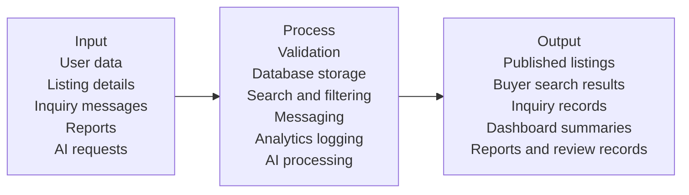
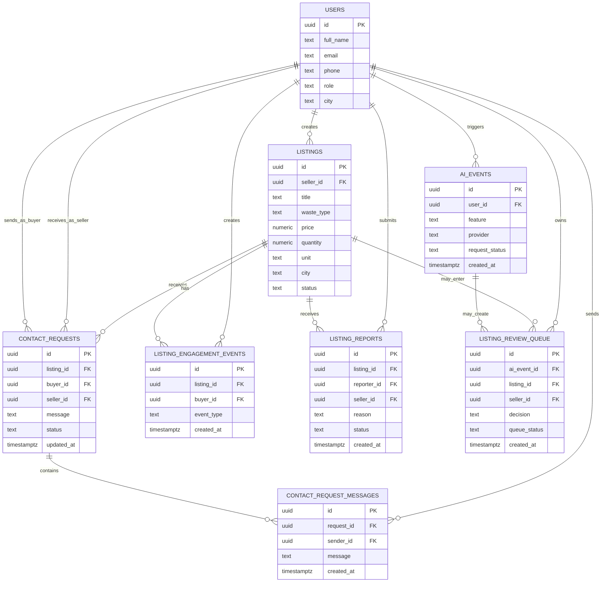

# DBMS Project Proposal

## 1. Title Slide

- Project Title: **Refamora: A Mobile Agricultural Waste Marketplace for Farmers and Buyers in the Philippines**
- Your Name: `[Insert Your Name]`
- Course / Program: `[Insert Course / Program]`
- Instructor: `[Insert Instructor]`
- Date: `April 23, 2026`

## 2. Introduction

- Agricultural waste such as rice straw, coconut husk, cassava peel, and corn stalks still has value.
- Many farmers do not have a dedicated system for listing and selling these materials.
- Buyers also have difficulty finding available agricultural waste in one place.
- Current transactions are often informal, scattered, or manually coordinated.
- A database system is needed to organize users, listings, messages, reports, and activity records.
- Refamora is proposed as a mobile marketplace for agricultural waste exchange.

## 3. Problem Statement

- Lack of a centralized database for agricultural waste listings and user records.
- Difficulty in connecting farmers with buyers who need reusable agricultural waste.
- Inefficient tracking of inquiries, messages, and listing activity.
- Lack of organized reporting and moderation for suspicious or inaccurate listings.
- Difficulty in maintaining complete and searchable records for marketplace transactions.

## 4. Objectives

### General Objective

- To design and develop Refamora, a mobile agricultural waste marketplace with a database system for managing users, listings, inquiries, and reports.

### Specific Objectives

- To design a database structure for users, listings, contact requests, messages, and reports.
- To implement a role-based system for farmers and buyers.
- To improve the storage and retrieval of listing and inquiry data.
- To provide organized monitoring of listing activity, reports, and AI-assisted records.
- To develop a mobile system that supports easier agricultural waste exchange.

## 5. Scope and Limitations

### Scope

- Farmer and buyer user accounts
- Agricultural waste listing creation and management
- Search, filtering, and map-based listing discovery
- Inquiry and message tracking
- Listing reports and moderation records
- AI event logging and review queue records
- Dashboard data for views and inquiries

### Limitations

- Limited to selected agricultural waste categories only
- No integrated payment processing yet
- No delivery or logistics management yet
- Requires internet access for real-time data and AI features
- Prototype only; not yet deployed for large-scale public use

## 6. Proposed System Overview

### Description of the System

Refamora is a mobile marketplace system for agricultural waste exchange. It allows farmers to create and manage listings for reusable farm by-products, while buyers can browse, search, filter, and inquire about available materials. The system uses a centralized database to store user accounts, listing details, inquiry records, reports, and system activity. It also includes AI-assisted features to improve listing quality, photo checking, moderation, and messaging support.

### Key Features

- User registration and role selection for farmers and buyers
- Listing creation with title, waste type, price, quantity, image, and location
- Buyer search, filters, and map view
- Inquiry and messaging system
- Listing reports for suspicious or inaccurate posts
- Dashboard summaries for listing views and inquiries
- AI-assisted listing support, photo checking, moderation, and inbox assistance

## 7. Conceptual Framework

### Input -> Process -> Output Diagram

### Input

- User registration data
- Listing information
- Buyer inquiries and messages
- Listing report details
- AI feature requests

### Process

- User authentication and role checking
- Saving records in the database
- Search and filter operations
- Inquiry and message handling
- Analytics and report logging
- AI-based validation and assistance

### Output

- Published and searchable listings
- Buyer inquiry records
- Dashboard summaries
- Listing reports
- AI-assisted results and review records

## 8. Database Design

### List of Tables (Entities)

#### Main Tables

- `users`
- `listings`
- `contact_requests`
- `contact_request_messages`
- `listing_engagement_events`
- `listing_reports`

#### Support Tables

- `ai_events`
- `listing_review_queue`
- `waste_suggestions`

### Relationships (Brief)

- One `user` can create many `listings`.
- One `listing` belongs to one seller from the `users` table.
- One `listing` can receive many `contact_requests`.
- One `contact_request` belongs to one buyer, one seller, and one listing.
- One `contact_request` can contain many `contact_request_messages`.
- One `listing` can have many `listing_engagement_events` such as views.
- One `listing` can receive many `listing_reports`.
- One `user` can trigger many `ai_events`.
- One `ai_event` may create a `listing_review_queue` record.

## 9. ER Diagram

### ER Diagram

## 10. Methodology

### Development Method

- **Software Development Life Cycle (SDLC)**

### Phases

#### 1. Planning

- Identify the problem in agricultural waste exchange
- Define users, features, and data requirements
- Prepare the project proposal and schedule

#### 2. Design

- Design the user flows for farmers and buyers
- Design the database tables and relationships
- Prepare the conceptual framework and ER diagram

#### 3. Development

- Build the mobile interface
- Implement the database tables and backend services
- Connect listings, messaging, reports, and analytics features

#### 4. Testing

- Test user registration and login
- Test listing creation, search, inquiries, and reports
- Test database operations and error handling
- Debug issues before final presentation

## 11. Tools and Technologies

- Database: **PostgreSQL (Supabase)**
- Programming Language: **TypeScript**
- Frontend: **React Native with Expo**
- Routing: **Expo Router**
- Backend / Cloud: **Supabase Auth, Storage, Edge Functions**
- Validation Tools: **Zod, React Hook Form**
- AI Tools: **Groq Qwen 3 32B, Groq Vision (Llama)**
- Development Tools: **Node.js, npm, Git, VS Code**

## 12. Expected Results

- Faster storage and retrieval of user, listing, and inquiry data
- Better organization of marketplace records in one database system
- Easier tracking of listing activity, reports, and messages
- Reduced errors in manual recording and scattered transactions
- Improved listing quality through AI-assisted support
- Better communication between farmers and buyers

## 13. Timeline

- **April 23-29, 2026:** Proposal preparation
- **April 30-May 6, 2026:** System planning and design
- **May 7-13, 2026:** Database development and initial implementation
- **May 14-20, 2026:** System implementation, testing, and documentation
- **May 21-23, 2026:** Final documentation, presentation preparation, and defense

## 14. Conclusion

This proposal presents Refamora as a DBMS-based mobile marketplace for agricultural waste exchange. The project aims to organize users, listings, messages, reports, and activity records in a structured database system that supports both farmers and buyers. By building this system, the study expects to improve data organization, reduce manual errors, and make agricultural waste exchange more efficient and manageable.

## 15. Timeline (Gantt Chart)

### Project Duration

- Start: **April 23, 2026**
- End (Final Presentation): **May 23, 2026**

### Gantt Chart

| Task | Apr 23-29 | Apr 30-May 6 | May 7-13 | May 14-20 | May 21-23 |
|---|---|---|---|---|---|
| Proposal Preparation | [====] |  |  |  |  |
| System Planning & Design |  | [====] |  |  |  |
| Database Development |  |  | [====] |  |  |
| System Implementation |  |  | [====] | [====] |  |
| Testing & Debugging |  |  |  | [====] |  |
| Documentation |  |  |  | [====] | [==] |
| Final Presentation Prep |  |  |  |  | [==] |
| Final Defense |  |  |  |  | [=] |

## 16. Q&A

- Questions and Answers
- Thank you

## Note

This file is written in a slide-ready DBMS proposal format based on the current Refamora app and database schema. If you want, the next step can be converting this into a shorter PowerPoint-ready version with one slide per section.
